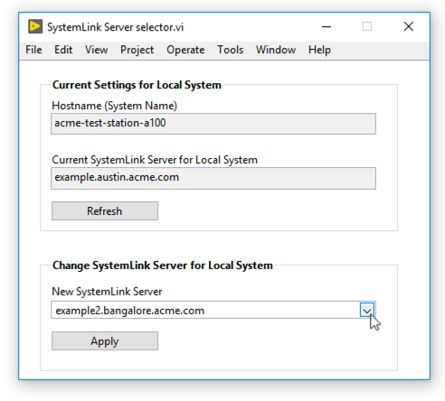

# systemlink-server-selector
 Example LabVIEW 2017 VI that allows the user on a SystemLink client system to select from a pre-populated list of SystemLink Servers to connect to.  The list is dynamically populated by a text file.

*SystemLink Server Selector VI Front Panel*

*Text file with Server hostnames or IP addresses*

